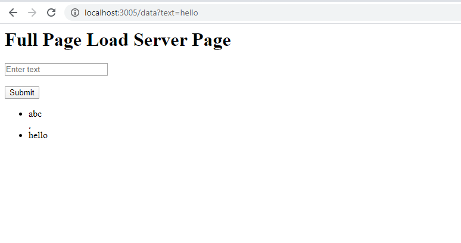
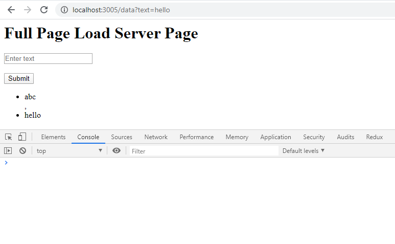
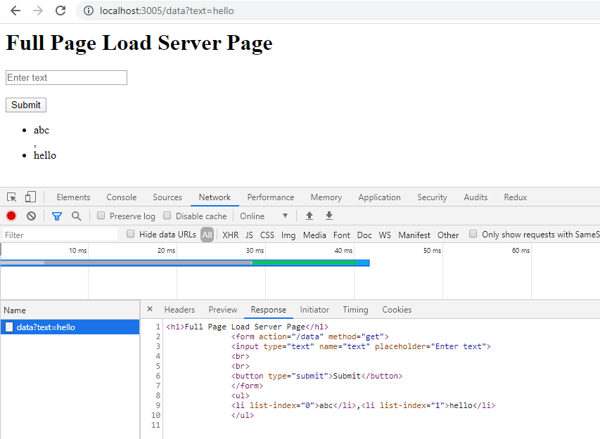
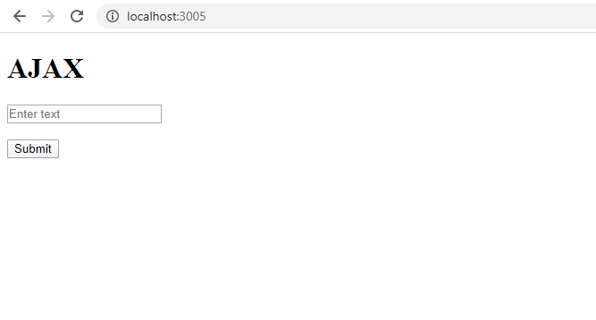
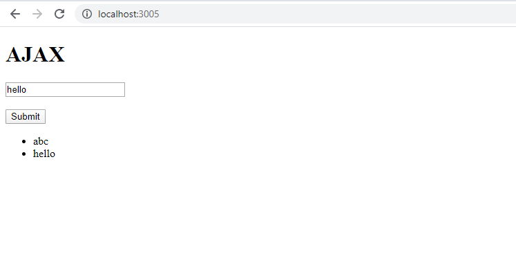
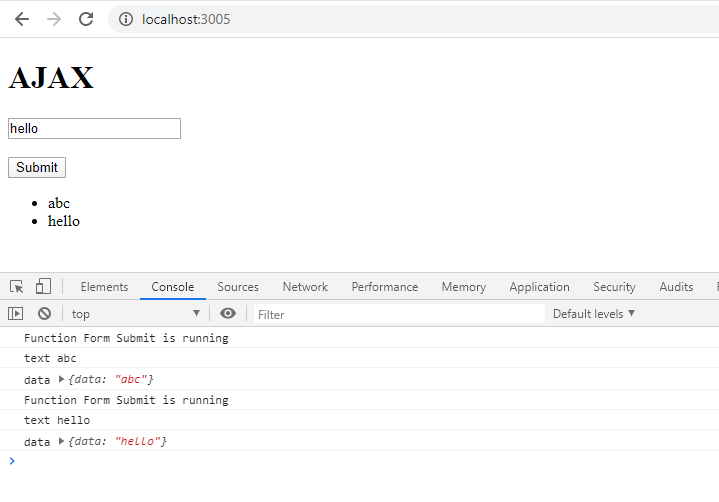
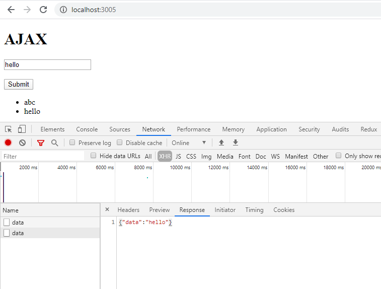

### AJAX Vs Full Page Load

#### This project includes
* Backend - A simple node.js server to test your work locally and get a better understanding of how Ajax is different from full load page. 
* Frontend - A form and list appended Dynamically
  * An input box in which any random text can be entered. It can be name, place, food etc.
  * Submit button - Lets you submit the text you have entered which can be displayed as a list.

##### Prerequisits for the project
* NPM and node installed.
* Basic Knowledge of how to start a node.js server.

#### Start with the project
* Clone the repository
* Change the terminal to that repository `cd AjaxVsFullPageLoad`
* Open the project in some editor (VSCode type  `code .` )
* run the command `npm install` in the terminal

##### Note: - The project includes both the server and the required files in a single project. Run the project files one after another. 

* ##### Full Load page
  * To start the full page load server - type command `npm run-script fullLoad`
  * Go to web Browser and type `http://localhost:3005`
  * You will see a heading as `Full Page Load`, an Input box to type a text and a submit button.
  
  * Try entering any text in the input field and click on the submit button.
  * Page after submit button has been clicked
  
  * The console of the browser will be empty as new page has been rendered.
  
  * The reponse of the server which shows that a new page has been rendered i.e a new page has been send as a response to the browser.
  
  * Now go back to the editor in which server is running. Open the folder `Full_page_load` and inside this folder you will see a `public` folder and a `server.js` file.
  * Open the `public` folder and try to make changes in `index.html`. See the changes on the Browser.
  * Now open `server.js` file and then make the changes as per guided by the **server.js** file to understand the flow
  * To close the server press `Ctrl+C` and then `Y`
  
  * ###### Points which shows full page is Loaded -
    * `console.log('Full Load Page for first time')` prints only once
    * Heading has been changed
    * The Url of the browser has been changed from `localhost:3005` to `localhost:3005/?text={**entered text**}` *entered text* the text you have entered
    * The response in the Network tab is an `HTML`

##### Now let us proceed with another way of doing this. Make sure you have closed the server of `full page load`.    

* ##### AJAX
  * To start the Ajax server type command `npm run-script ajax`
  * Go to web Browser and type `http://localhost:3005`
  * You will see a heading as `AJAX`, an input box in which text can be entered and a submit button.
  
  * Try entering any text in the input field and click on the submit button.
  * Page after submit button has been clicked
  
  * The console of the browser gets new values of the data which are `console.log` in `index.js` file.
  
  * The response in the Network tab of the browser will be -
  
  * Now go back to the editor where the `server.js` file is running and open the folder `Ajax`
  * The folder contains a folder `public` which has `index.html` and `index.js` file and a `server.js` file.
  * Open the `index.html` file and make changes to frontend. Try to `console` at different places in `index.js`.
  * Make the changes as per guided by the `index.js` file.
  * Similarly make changes to **server.js** file gradually to understand the flow.

  * ###### Points which shows Ajax is used
    * The heading of the file remains same.
    * The `console` tab in the browser gets new values every time you enter a text in the input box instead of getting emptied
    * The network tab in Browser has `json` response.
    

##### Points To remember 
- Only single node.js server will run at a time so make sure to run one at a time.
- try to put `console.log()` at different places in JS files.
- Make changes gradually to understand the concept.
- Whatever is send by the server the Browser treats it as an HTML object and displays as it is.

##### Common Errors
- `console.log()` of server.js are viewed in terminal where it is running and of frontend ,are viewed on browser console (CTRL + SHIFT + I)
- A single response should be there for a single request hence multiple send will not work in server.js.  
- Restart the server ever time a change is made to server.js and refresh the browser for frontend changes.   

